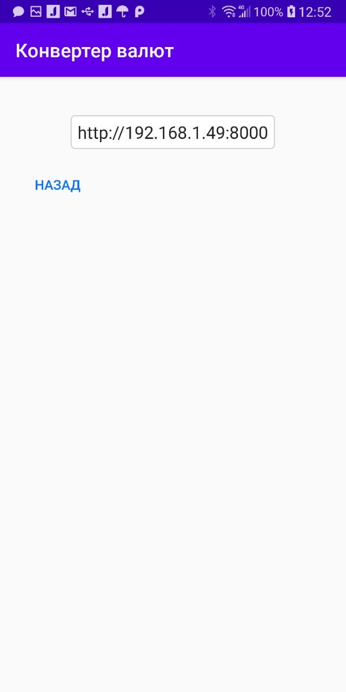

<h1>Currency converter</h1>

It is currency converter

At first, user must enter the currency names in the fields: currency 1, currency 2.

Then you can enter the address of server. you can do this by clicking on the address at the top or by long-pressing the send button.

